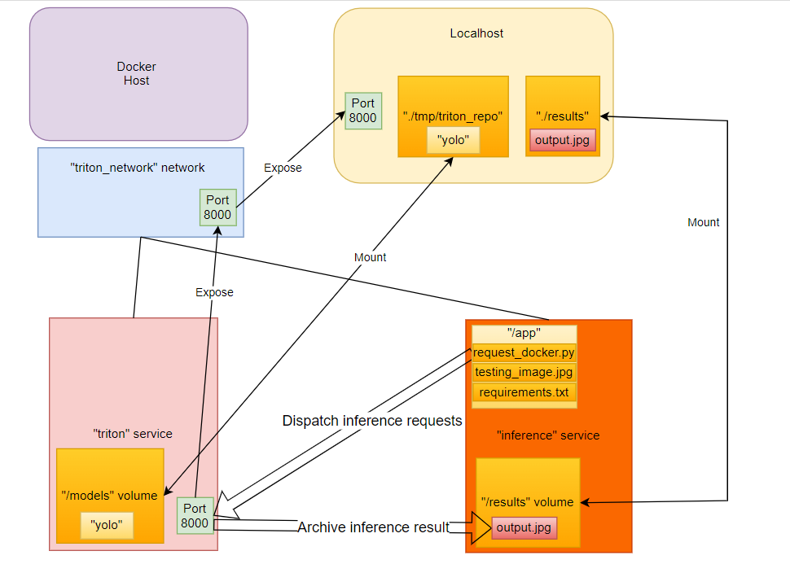

## STEPS AND SOLUTIONS

Before demonstrating the solutions for this code, I strongly believe it is essential to introduce the files and folders in this directory as well as their purposes:

### File introduction

1. `export.py`: this file exports the downloaded "model/yolov8n.pt" weight as .onnx format then checkpoints it into the "tmp/triton_repo/yolo/1/model.onnx" directory.

2. `run.py`: this file tries to pull the "nvcr.io/nvidia/tritonserver:22.04-py3" image (if it does not exists), run the corresponding container and logs its id into the `id.env` (this file is automatically created if it does not exists) file under the form **CONTAINER_ID={container_id}**.

3. `kill.py`: this file tries to check the existence of `id.env` and kill the container having id CONTAINER_ID (if it is running), then deletes the contents of the .env file.

4. `request.py`: this file downloads the image attached to the **image-url** then saves it to **image-path** directory, then calls the model hosted on triton server at port 8000 to get the inference image and saves it into **output-path** (with detected bounding boxes readily drawn). The `request_docker.py` file has the same purpose except it modifies the path to call to triton server (in the **triton_server** container) since it will be runned inside the **triton_inference** container.

5. `Dockerfile`: is used to build **triton_inference** image for Assignment 2

6. `docker-compose.yml` is used for composing **triton_server** and **triton_infernce** containers for Assignment 2

### Folder introduction

1. `./model`: contains our yolov8n.pt model
2. `./results`: the volume containing the **output.jpg** image after inference from "triton_inference" container
3. `./tmp/triton_repo/yolo/1/model.onnx`: the input model format for "triton_server"

## SOLUTION FOR ASSIGNMENT 1:

- Step 1: Converting the downloaded .pt model into .onnx format by running `export.py`
- Step 2: Host Triton Inference Server by running `run.py`. The corresponding container will be created after this run and its id will be recorded into the "id.env" file.
- Step 3: Run

```
python request.py --image-url "https://drive.google.com/uc?export=download&id=1VekyUJdAR1X1uyQBG9D7L9QdI16_29cq" --image-path testing_image.jpg --output-path output.jpg
```

to get the **output.jpg** inference result, which calls to port 8000 of the Triton Inference Server then retrieves and draws detected classes as well as bounding boxes, which should be located in the same directory as this file.

- Step 4: Kill the container automatically by running `kill.py`.

## SOLUTION FOR ASSIGNMENT 2:

(**Note:** This should be done after Assignment 1, in other words, the image "nvcr.io/nvidia/tritonserver:22.04-py3" should be pulled before proceeding to this task).

- Step 1: Build the **triton_inference** image by running

```
docker build -t triton_inference .
```

- Step 2: Compose the **triton_inference** (using the image having the same name) and **triton_server** (using "nvcr.io/nvidia/tritonserver:22.04-py3" image) into "inference" and "triton" services residing in the same network named "triton_network" :

```
docker-compose up -d
```

(**Note :** the "inference" service is already configured to run only when the "triton" service is healthy).

After this step, the **output.jpg** should appear in the "./results" folder after a few seconds.

- Step 3: Kill these two services by running

```
docker-compose down
```

To further illustrate the solution of Assignment 2, please to this this following diagram:


